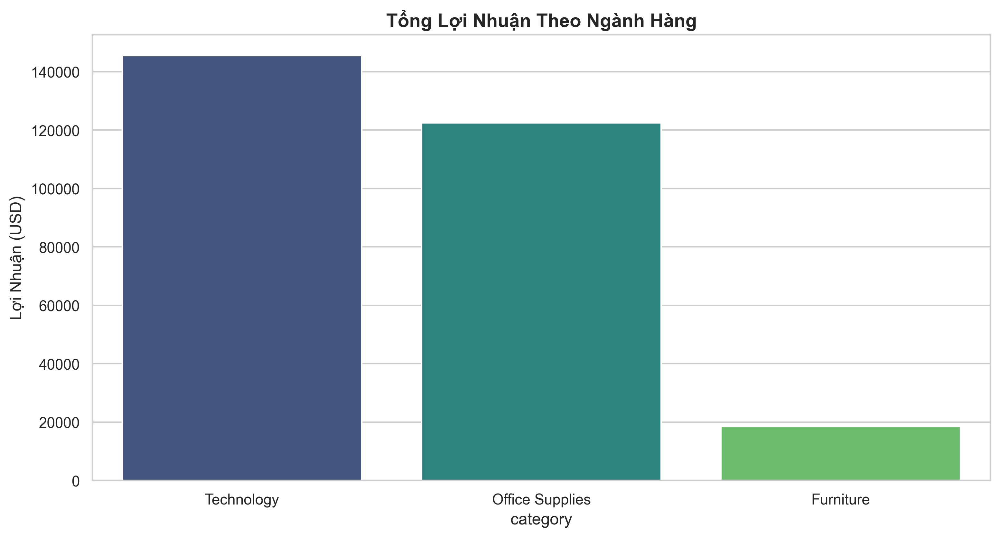
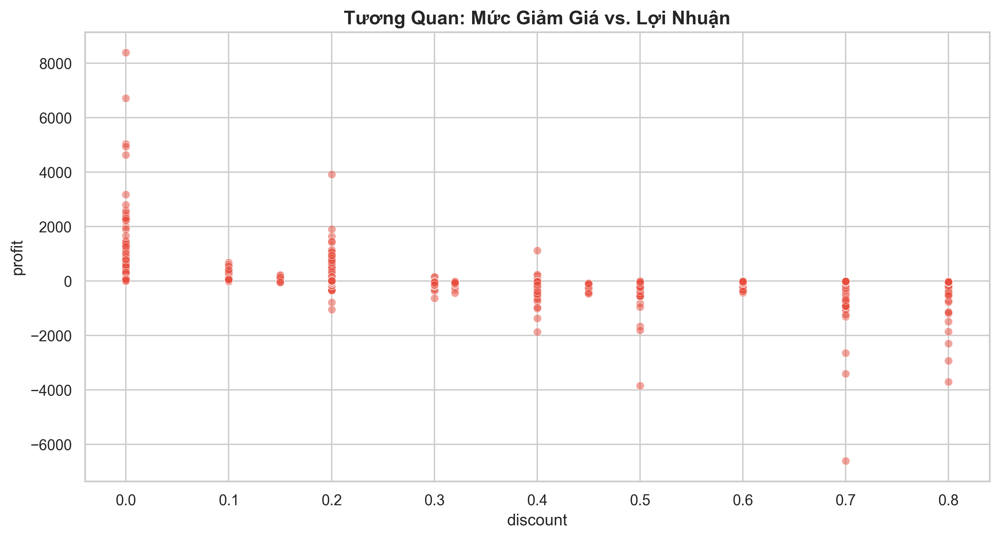
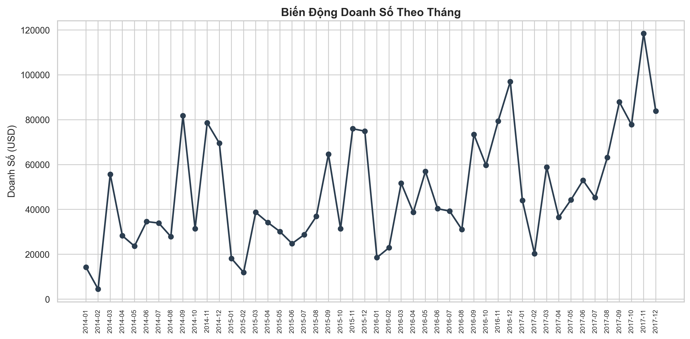

# Superstore Sales Analysis & Optimization
> **A Data Analysis Project using Python**

[](https://www.python.org/)
[]()
[]()

---

1. Project Overview
This project analyzes sales data from a fictional "Superstore" retail chain (9,994 transactions). The goal is to perform **Exploratory Data Analysis (EDA)** to identify sales trends, profit drivers, and areas for cost optimization.

The project is built with a modular structure, simulating a real-world data engineering and analysis workflow: **Auto-download -> ETL (Extract, Transform, Load) -> Visualization -> Reporting.**

2. Key Business Insights
Based on the analysis (detailed in `reports/`), here are the critical findings:
* **Seasonality:** Sales peak significantly in Q4 (Nov-Dec), driven by holiday demand.
* **Profit Issues:** While "Furniture" generates high revenue, it has the lowest profit margin due to operational costs.
* **Discount Strategy:** A discount rate > 20% negatively impacts total profit. Heavy discounts (>50%) result in significant losses.

3. Project Structure
```text
Superstore_Analytics/
├── data/                   # Raw data storage
├── notebooks/              # Jupyter Notebooks for EDA & storytelling
├── reports/
│   └── figures/            # Generated charts and graphs
├── src/                    # Source code
│   ├── download.py         # Kaggle API integration
│   ├── process.py          # Data cleaning & feature engineering
│   └── visualize.py        # Plotting logic
├── main.py                 # Entry point (Run this file)
└── requirements.txt        # Dependencies